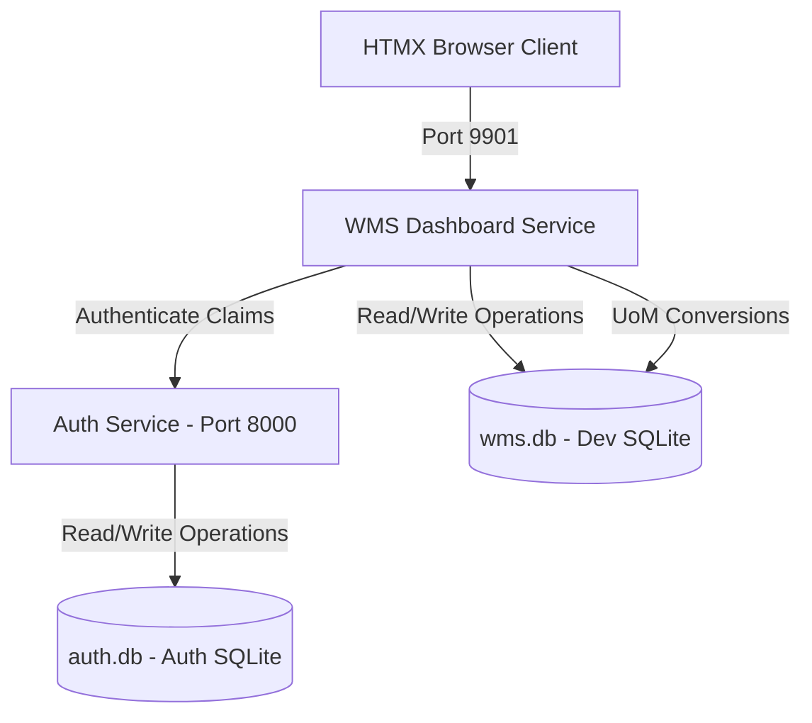

# Omnisync WMS - Agent Workspace & Architecture Guide

Welcome to the Omnisync WMS developer and agent context registry. This file documents the structural details, active configurations, database architecture, security layers, and test suites for the Omnisync WMS Suite.

---

## 🗺️ Project Architecture Overview

The WMS suite is organized into two primary microservices, connecting to separate SQLite data backends:



### 1. Auth Service (`auth_services/`)
- **Port**: `8000`
- **Database**: `auth.db`
- **Responsibility**: Authenticates credentials, generates cryptographically signed JWT tokens, and manages the `User` and `Role` definitions. The default initial roles are `System Admin`, `Admin WMS`, `Procurement`, and `POS`.

### 2. WMS Dashboard Service (`wms_dashboard/`)
- **Port**: `9901` (dynamically configurable)
- **Database**: `wms.db` (uses pure-Go `github.com/glebarez/sqlite` to prevent CGo runtime requirements on Windows/Linux host environments)
- **Responsibility**: Orchestrates the main WMS client dashboard, physical stock tracking with unit labels, inventory movements with dynamic packaging conversions, and the **Master Data Registry**.

---

## 🔒 Master Data & Role Access Policies

The **Master Data Maintenance Registry** manages the physical layouts, product catalog items, units of measure, and dynamic packaging conversions.

### Seeded System Roles
- **System Admin**: Full cross-system access, role/user administration, and master data mutate permissions.
- **Admin WMS**: Administrator for warehouse operations and master data mutate permissions.
- **Procurement**: Operator for incoming logistics, stock adjustments, and master data views.
- **POS**: Point of Sale operator for outbound picks, stock inquiries, and master data views.

### Endpoint Matrix & Permissions

| Component | Path Prefix | HTTP Methods | Allowed Roles | Description |
| :--- | :--- | :--- | :--- | :--- |
| **Products** | `/wms/masters/products` | `GET` (List & Forms) | All logged-in roles | View catalog list with Base UoM / open forms |
| **Products** | `/wms/masters/products` | `POST`, `PUT`, `DELETE` | `System Admin`, `Admin WMS` | Create, update, or soft-delete products |
| **Warehouses** | `/wms/masters/warehouses` | `GET` (List & Forms) | All logged-in roles | View facilities list / open forms |
| **Warehouses** | `/wms/masters/warehouses` | `POST`, `PUT`, `DELETE` | `System Admin`, `Admin WMS` | Create, update, or soft-delete facilities |
| **Locators** | `/wms/masters/locators` | `GET` (List & Forms) | All logged-in roles | View locator grid / open forms |
| **Locators** | `/wms/masters/locators` | `POST`, `PUT`, `DELETE` | `System Admin`, `Admin WMS` | Create, update, or soft-delete shelf locators |
| **Units of Measure** | `/wms/masters/uoms` | `GET` (List & Forms) | All logged-in roles | View UoM list and Conversions split panel / open forms |
| **Units of Measure** | `/wms/masters/uoms` | `POST`, `PUT`, `DELETE` | `System Admin`, `Admin WMS` | Create, update, or soft-delete standard units |
| **Conversions** | `/wms/masters/conversions` | `GET` (Form) | All logged-in roles | Open conversion modal with dynamic formula preview |
| **Conversions** | `/wms/masters/conversions` | `POST`, `DELETE` | `System Admin`, `Admin WMS` | Create or delete conversion rules |
| **System Roles** | `/wms/system/roles` | `GET`, `POST`, `DELETE` | `System Admin`, `Admin WMS` | Manage operational roles |
| **System Users** | `/wms/system/users` | `GET`, `POST`, `PUT` | `System Admin`, `Admin WMS` | Manage users and their roles |
| **Adjustments** | `/wms/adjustments` | `GET`, `POST` | All logged-in roles | View and create direct stock adjustments |
| **Kitting** | `/wms/kitting` | `GET`, `POST` | All logged-in roles | Perform product assembly and kitting |
| **QC Holds** | `/wms/qc-holds` | `GET`, `POST` | All logged-in roles | Freeze stock quantities under QC investigation |
| **QC Holds** | `/wms/qc-holds/:id/release` | `POST` | All logged-in roles | Release frozen stock back to available inventory |

---

## 🗃️ Database Migrations System

To prevent SQLite lockups and crash-prone schema synchronization in production, **GORM `AutoMigrate()` has been deprecated** for core schemas (except for tracking migrations). Instead, the system uses a custom pure-Go transactional SQL migration runner.

### Structural Details
- **Migration Location**: `/migrations/` (found in both `auth_services` and `wms_dashboard` roots).
- **Execution Mechanism**: Under `database.InitDB()`, the runner:
  1. Spawns/maintains a lightweight GORM-managed tracking table called `schema_migrations`.
  2. Reads all `.sql` files in the service's `migrations/` directory.
  3. Sorts them alphabetically and cross-checks them against already applied records.
  4. Executes any pending migrations inside a **single ACID transaction** using raw SQL.
- **Current Seed Scripts**:
  - `auth_services/migrations/0002_seed_roles.sql`: Seeds the operational system roles.
  - `wms_dashboard/migrations/0002_seed_wms_master.sql`: Seeds default physical layouts, base units, and conversions.

---

## 🛡️ Relational Database Safeguards

To protect historical movement transactions and inventory records, the repository layer enforces strict transaction checks:

1. **Product Deletion Block**:
   - Deletion is prevented if physical stock remains (`qty_on_hand > 0`) in storage lots.
   - Deletion is prevented if the product is referenced in any historic `InventoryMovementLine` documents.
2. **Warehouse Deletion Block**:
   - Deletion is prevented if storage locators are defined within this warehouse.
3. **Locator Deletion Block**:
   - Deletion is prevented if physical stock currently resides on the shelf coordinates.
4. **UoM Deletion Block**:
   - Deletion is prevented if any product uses it as its Base UoM.
   - Deletion is prevented if any active conversion rule references it.

5. **QC Hold Stock Freeze**:
   - The `Storage` model now carries a `qty_on_hold` column. This quantity is excluded from **all** available-stock calculations across Outbound Movements, Kitting, and Adjustments.
   - Only the `ReleaseQCHold` function can decrement `qty_on_hold` back to available stock.

*Note: All deleted master records are **soft-deleted** (`gorm.DeletedAt` GORM schema attribute) to preserve ledger audits.*

---

## 🔢 Centralized Sequence & Numbering Engine

Omnisync WMS uses a transaction-locked dynamic numbering sequence engine to generate standardized, traceable document and batch numbers.

### 1. Database Schema (`sequence_generators`)
Tracks prefixes, lengths, current offset, and fiscal year per table context:
- `usage_table` (Unique Index, e.g. `inventory_movements`, `qc_holds`, `storages`)
- `prefix` (e.g. `MOV`, `ADJ`, `KIT`, `QCH`, `BAT`)
- `fiscal_year` (e.g. `2026`)
- `current_number` (Atomic increment offset)
- `number_length` (Padded length)

### 2. ACID Transaction Safety
Sequences are requested entirely within GORM transaction blocks using GORM `.Clauses(clause.Locking{Strength: "UPDATE"})` to trigger standard row-level transaction locks (`SELECT FOR UPDATE`), preventing collisions or duplicate numbers during high-volume operations.

### 3. Dynamic Fiscal Year Rollover
If the calendar system year is greater than the stored `fiscal_year`, the engine:
1. Resets `current_number` back to `1`.
2. Updates `fiscal_year` to the current year.
3. Automatically transitions numbering patterns seamlessly (e.g. `MOV-2026-00001` -> `MOV-2027-00001`).

---

## 🛠️ Operations & Development Playbook

### Running the Services Locally
Start both backend services using PowerShell in the root directory:

```powershell
# Start the Auth Service
cd auth_services
go run cmd/main.go

# Start the WMS Dashboard Service (Set GOCACHE paths to projects local directory)
cd ../wms_dashboard
$env:GOMODCACHE="D:\Code\projects\omnisync_wms\go_cache\pkg\mod"
$env:GOCACHE="D:\Code\projects\omnisync_wms\go_cache\build"
go run cmd/main.go
```

### Running Automated Test Suites
Run the database transaction safeguards test suite offline using an isolated, in-memory SQLite database connection:

```powershell
cd wms_dashboard
$env:GOMODCACHE="D:\Code\projects\omnisync_wms\go_cache\pkg\mod"
$env:GOCACHE="D:\Code\projects\omnisync_wms\go_cache\build"
go test -v ./internal/repository/...
```

---

## ⚠️ AI Agent Development Gotchas & Best Practices

1. **Environment Variables & Secrets:** 
   - There are **no hardcoded credentials** in the source code. Both services strictly require `.env` files.
   - If writing custom run scripts (like `run_all.ps1`), remember that background child processes or new PowerShell windows **do not** automatically inherit `.env` context via `godotenv`. You must explicitly parse the `.env` file and export the variables into the parent shell environment before launching child processes.
2. **GORM Pluralization Quirk:**
   - GORM's automatic snake_case pluralization breaks on acronyms with mixed casing. For example, `UoM` becomes `uo_ms` and `UoMConversion` becomes `uo_m_conversions`. 
   - **Rule:** Always use explicit `TableName()` receiver methods on models involving acronyms to enforce clean database table names (e.g., `func (UoM) TableName() string { return "uoms" }`).
3. **Number Inputs with Absolute Text:**
   - Avoid absolutely positioning text (like `Factor`) inside a `<input type="number">` on the right side. Browser default spinner arrows (up/down) will render over the text. Prefer putting labels outside the input or using browser-native styling hacks.
4. **Dynamic Lucide Re-rendering & UI Collapses:**
   - Lucide converts standard `<i>` tags into `<svg>` elements on load. Calling `.setAttribute("data-lucide", ...)` directly on the generated `<svg>` tag will **not** trigger Lucide to re-draw.
   - **Rule:** To dynamically change an icon, always recreate a fresh `<i>` element inside the container (e.g. `container.innerHTML = '<i data-lucide="..."></i>'`) and trigger `lucide.createIcons()` again.
   - **Clipping/Opacity on Collapsible Containers:** When animating a container to `width: 0` and `opacity: 0` (like a collapsed sidebar), do **not** place toggle triggers inside that container. They will inherit transparency and clipping, rendering them invisible. Keep floating controllers outside the collapsed aside in the DOM tree.
5. **No Manual Closing of GitHub Issues:**
   - **Rule:** Do NOT manually close GitHub issues. Always leave issues open and let the Pull Request automatically close the linked issue upon merging (e.g. by using the `Closes #XX` or `Resolves #XX` pattern in the PR body description). Ensure you commit all changes, push them to a feature branch, and create a PR instead of directly closing the issue.

---

## 💡 Tech Stack Checklist
- **Backend Framework**: Go Fiber v2
- **Database Mapping**: GORM v2 (ORM) + Pure-Go SQLite Driver (`github.com/glebarez/sqlite`)
- **Frontend SPA Layer**: HTMX v1.9.10 (Asynchronous swaps & dynamic forms)
- **Styling Core**: Tailwind CSS v4.0 + Custom Glassmorphism Theme (Outfit + Inter font faces)
- **Iconsets**: Lucide Icons (asynchronously re-bound on HTMX swaps)
