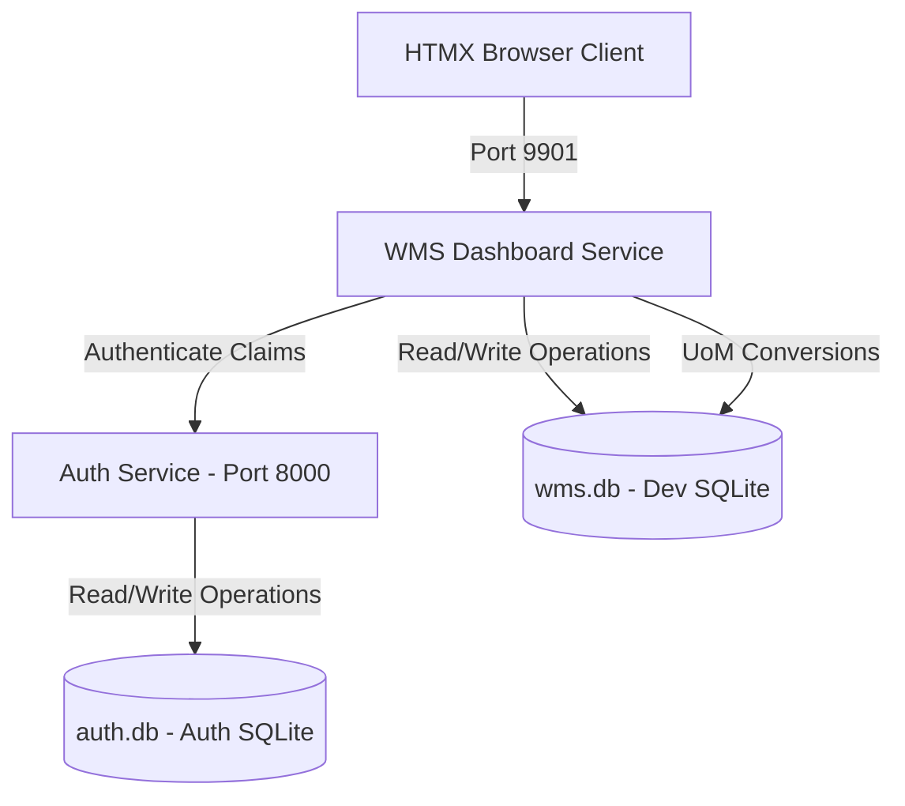

# Omnisync WMS - Agent Workspace & Architecture Guide

Welcome to the Omnisync WMS developer and agent context registry. This file documents the structural details, active configurations, database architecture, security layers, and test suites for the Omnisync WMS Suite.

---

## 🗺️ Project Architecture Overview

The WMS suite is organized into two primary microservices, connecting to separate SQLite data backends:



### 1. Auth Service (`auth_services/`)
- **Port**: `8000`
- **Database**: `auth.db`
- **Responsibility**: Authenticates credentials, generates cryptographically signed JWT tokens, and exposes user identities (Roles: `admin` or `operator`).

### 2. WMS Dashboard Service (`wms_dashboard/`)
- **Port**: `9901` (dynamically configurable)
- **Database**: `wms.db` (uses pure-Go `github.com/glebarez/sqlite` to prevent CGo runtime requirements on Windows/Linux host environments)
- **Responsibility**: Orchestrates the main WMS client dashboard, physical stock tracking with unit labels, inventory movements with dynamic packaging conversions, and the **Master Data Registry**.

---

## 🔒 Master Data & Role Access Policies

The **Master Data Maintenance Registry** manages the physical layouts, product catalog items, units of measure, and dynamic packaging conversions.

### Endpoint Matrix & Permissions

| Component | Path Prefix | HTTP Methods | Allowed Roles | Description |
| :--- | :--- | :--- | :--- | :--- |
| **Products** | `/wms/masters/products` | `GET` (List & Forms) | `admin`, `operator` | View catalog list with Base UoM / open forms |
| **Products** | `/wms/masters/products` | `POST`, `PUT`, `DELETE` | `admin` only | Create, update, or soft-delete products |
| **Warehouses** | `/wms/masters/warehouses` | `GET` (List & Forms) | `admin`, `operator` | View facilities list / open forms |
| **Warehouses** | `/wms/masters/warehouses` | `POST`, `PUT`, `DELETE` | `admin` only | Create, update, or soft-delete facilities |
| **Locators** | `/wms/masters/locators` | `GET` (List & Forms) | `admin`, `operator` | View locator grid / open forms |
| **Locators** | `/wms/masters/locators` | `POST`, `PUT`, `DELETE` | `admin` only | Create, update, or soft-delete shelf locators |
| **Units of Measure** | `/wms/masters/uoms` | `GET` (List & Forms) | `admin`, `operator` | View UoM list and Conversions split panel / open forms |
| **Units of Measure** | `/wms/masters/uoms` | `POST`, `PUT`, `DELETE` | `admin` only | Create, update, or soft-delete standard units |
| **Conversions** | `/wms/masters/conversions` | `GET` (Form) | `admin`, `operator` | Open conversion modal with dynamic formula preview |
| **Conversions** | `/wms/masters/conversions` | `POST`, `DELETE` | `admin` only | Create or delete conversion rules |

---

## 🛡️ Relational Database Safeguards

To protect historical movement transactions and inventory records, the repository layer enforces strict transaction checks:

1. **Product Deletion Block**:
   - Deletion is prevented if physical stock remains (`qty_on_hand > 0`) in storage lots.
   - Deletion is prevented if the product is referenced in any historic `InventoryMovementLine` documents.
2. **Warehouse Deletion Block**:
   - Deletion is prevented if storage locators are defined within this warehouse.
3. **Locator Deletion Block**:
   - Deletion is prevented if physical stock currently resides on the shelf coordinates.
4. **UoM Deletion Block**:
   - Deletion is prevented if any product uses it as its Base UoM.
   - Deletion is prevented if any active conversion rule references it.

*Note: All deleted master records are **soft-deleted** (`gorm.DeletedAt` GORM schema attribute) to preserve ledger audits.*

---

## 🛠️ Operations & Development Playbook

### Running the Services Locally
Start both backend services using PowerShell in the root directory:

```powershell
# Start the Auth Service
cd auth_services
go run cmd/main.go

# Start the WMS Dashboard Service (Set GOCACHE paths to projects local directory)
cd ../wms_dashboard
$env:GOMODCACHE="D:\Code\projects\omnisync_wms\go_cache\pkg\mod"
$env:GOCACHE="D:\Code\projects\omnisync_wms\go_cache\build"
go run cmd/main.go
```

### Running Automated Test Suites
Run the database transaction safeguards test suite offline using an isolated, in-memory SQLite database connection:

```powershell
cd wms_dashboard
$env:GOMODCACHE="D:\Code\projects\omnisync_wms\go_cache\pkg\mod"
$env:GOCACHE="D:\Code\projects\omnisync_wms\go_cache\build"
go test -v ./internal/repository/...
```

---

## ⚠️ AI Agent Development Gotchas & Best Practices

1. **Environment Variables & Secrets:** 
   - There are **no hardcoded credentials** in the source code. Both services strictly require `.env` files.
   - If writing custom run scripts (like `run_all.ps1`), remember that background child processes or new PowerShell windows **do not** automatically inherit `.env` context via `godotenv`. You must explicitly parse the `.env` file and export the variables into the parent shell environment before launching child processes.
2. **GORM Pluralization Quirk:**
   - GORM's automatic snake_case pluralization breaks on acronyms with mixed casing. For example, `UoM` becomes `uo_ms` and `UoMConversion` becomes `uo_m_conversions`. 
   - **Rule:** Always use explicit `TableName()` receiver methods on models involving acronyms to enforce clean database table names (e.g., `func (UoM) TableName() string { return "uoms" }`).
3. **Number Inputs with Absolute Text:**
   - Avoid absolutely positioning text (like `Factor`) inside a `<input type="number">` on the right side. Browser default spinner arrows (up/down) will render over the text. Prefer putting labels outside the input or using browser-native styling hacks.

---

## 💡 Tech Stack Checklist
- **Backend Framework**: Go Fiber v2
- **Database Mapping**: GORM v2 (ORM) + Pure-Go SQLite Driver (`github.com/glebarez/sqlite`)
- **Frontend SPA Layer**: HTMX v1.9.10 (Asynchronous swaps & dynamic forms)
- **Styling Core**: Tailwind CSS v4.0 + Custom Glassmorphism Theme (Outfit + Inter font faces)
- **Iconsets**: Lucide Icons (asynchronously re-bound on HTMX swaps)
